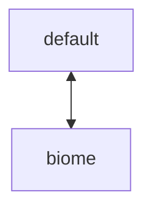
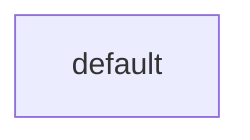

# entity.husk

## biome_detector

根据所处群系是否为沙漠/沙滩，进行状态的转换。

```mermaid
flowchart
    default <--> biome
```

# 附件

[(15条消息) markdown 画图_whatday的博客-CSDN博客_markdown 画图](https://blog.csdn.net/whatday/article/details/88655461)

### 空的流程图代码块

```mermaid
flowchart
	default
```

