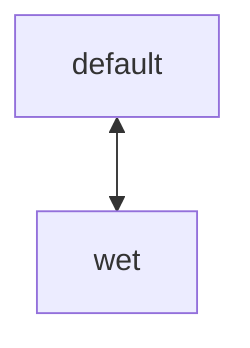
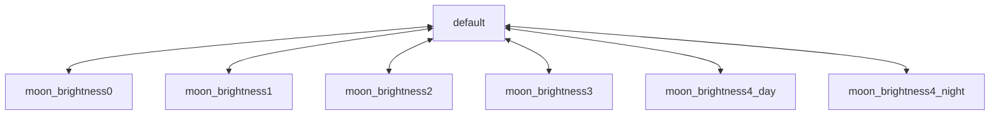
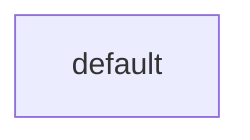

# entity.normal

## wet_detector

根据是否在雨中或水中，进行状态的转换。

## moon_stage

用于不同月相时，控制普通生物的不同表现。

# 附件

[(15条消息) markdown 画图_whatday的博客-CSDN博客_markdown 画图](https://blog.csdn.net/whatday/article/details/88655461)

### 空的流程图代码块

