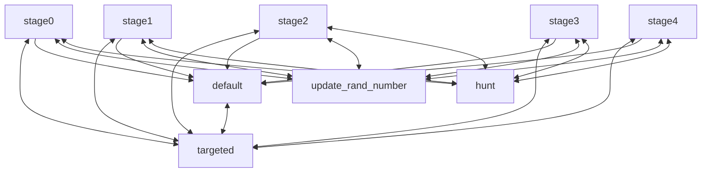
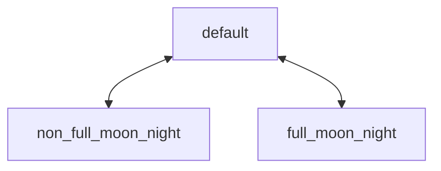
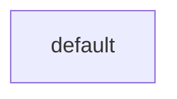

# entity.raged

> 以下内容仅适用于狂暴生物。

## random_hunt

在实体拥有目标时，根据月相的不同阶段，以不同概率进行猎杀。（猎杀技能控制器）

## full_moon_stage

根据是否为满月夜晚，控制狂暴生物的不同表现。

# 附件

[(15条消息) markdown 画图_whatday的博客-CSDN博客_markdown 画图](https://blog.csdn.net/whatday/article/details/88655461)

### 空的流程图代码块

