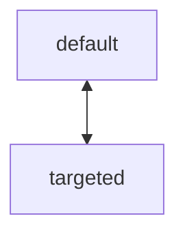
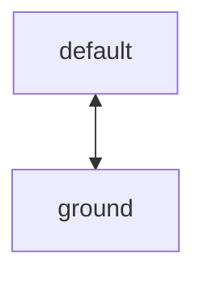
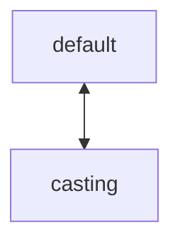
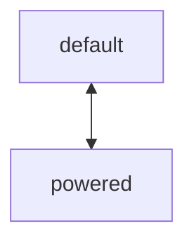
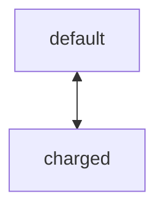
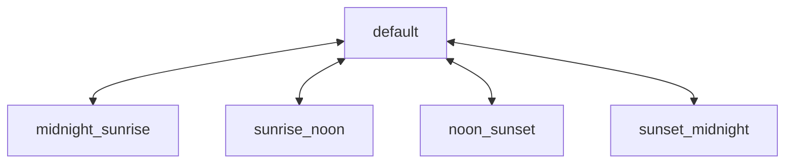
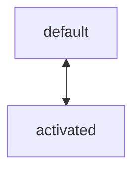
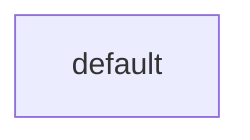

# test

## target_test

检测实体是否拥有目标。

## ground_test

检测实体是否在地面上。

## cast_test

检测实体是否正在施法。

## power_test

检测实体是否蓄力完成。

## charge_test

检测实体是否蓄力完成。

## time_test

检测当前时间位于的时间段。

## component.activation_test

在手持特定物品时，触发实体的测试事件，以激活测试用的组件组。

# 附件

[(15条消息) markdown 画图_whatday的博客-CSDN博客_markdown 画图](https://blog.csdn.net/whatday/article/details/88655461)

### 空的流程图代码块

