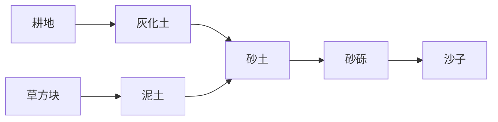

# entity.husk

## desertification

**循环：**是

**周期：**4s

**描述：**按顺序将脚下方块进行替换。

| 时间 | 命令                                                         |
| ---- | ------------------------------------------------------------ |
| 0.00 | /execute if block ~~-1~ gravel 0 run setblock ~~-1~ sand 0 replace /execute if block ~~-1~ dirt 1 run setblock ~~-1~ gravel 0 replace /execute if block ~~-1~ dirt 0 run setblock ~~-1~ dirt 1 replace /execute if block ~~-1~ podzol 0 run setblock ~~-1~ dirt 1 replace /execute if block ~~-1~ grass 0 run setblock ~~-1~ dirt 0 replace /execute if block ~~-1~ farmland -1 run setblock ~~-1~ podzol 0 replace |

