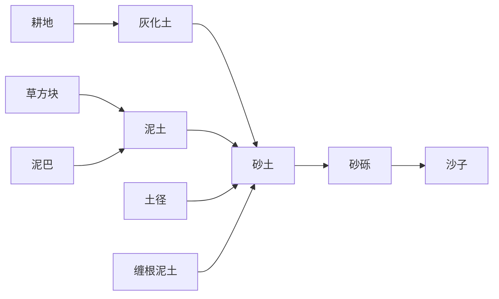

# 生物加强
**注：**<u>僵尸类生物</u>包括：*僵尸*|*狂暴僵尸*|*尸壳*|*狂暴尸壳*|*溺尸*|*狂暴溺尸*。

**注：**困难难度下，生物对玩家伤害会变为正常的1.5倍。

## 僵尸村民(zombie_villager)(zombie_villager_v2)

### 伤害与抵抗

| 属性名称 | 属性数值                                              |
| -------- | ----------------------------------------------------- |
| 生命     | 48                                                    |
| 护甲     | <u>所有伤害</u>：抵抗8% <u>摔落伤害</u>：减少4点 |
| 击退抗性 | 64%                                                   |
| 特殊防护 | 不在阳光下燃烧                                        |

| 属性名称         | 属性数值           |
| ---------------- | ------------------ |
| 近战伤害         | 1~100              |
| 近战攻击速度     | 1s                 |
| 近战攻击范围     | 0.8格              |
| 近战攻击特殊属性 | 附加30s*虚弱1*效果 |
| 远程伤害         | ——                 |
| 远程攻击速度     | ——                 |
| 远程攻击范围     | ——                 |
| 远程攻击特殊属性 | ——                 |

### 移动与寻路

| 属性名称         | 成年       | 小型       |
| ---------------- | ---------- | ---------- |
| 陆地移动速度     | 0.16       | 0.24       |
| 水中移动速度     | ——         | ——         |
| 移动速度特殊属性 | ——         | ——         |
| 移动方式         | 行走       | 行走       |
| 寻路方式         | 行走，攀爬 | 行走，攀爬 |
| 主动摔落距离     | 20格       | 20格       |
| 跳跃高度         | 3格        | 3格        |

**备注：**可以像蜘蛛一样爬墙。

### 索敌与反击

| 属性名称     | 属性数值 |
| ------------ | -------- |
| 跟踪距离     | 48格     |
| 目标丢失时间 | 20s      |
| 目标持续时间 | 3s       |

| 索敌种类                               | 范围 | 必须看到 | 必须可达 |
| :------------------------------------- | :--- | :------- | -------- |
| 玩家、<u>人类生物</u>、<u>友善生物</u> | 32格 | 否       | 否       |
| 悦灵、蜜蜂、海龟                       | 32格 | 是       | 否       |

**反击种类：**除<u>僵尸类生物</u>、女巫外的所有生物。

### 环境交互

| 可破坏方块类别            | 范围 |
| ------------------------- | ---- |
| <u>怪物基础可破坏物品</u> | 所有 |

**注：**<u>怪物基础可破坏物品</u>包括蜘蛛网、仙人掌、竹子、甜浆果丛、细雪。

### 特殊技能

#### 仇视

##### **技能条件**

自身拥有攻击目标。

##### 发动周期

4秒。

##### 技能效果

对6格范围内的目标施加30s*缓慢1*效果。

## 僵尸(zombie)
### 伤害与抵抗

| 属性名称 | 属性数值                |
| -------- | ----------------------- |
| 生命     | 48                      |
| 护甲     | <u>所有伤害</u>：抵抗8% |
| 击退抗性 | ——                      |
| 特殊防护 | ——                      |

| 属性名称         | 属性数值 |
| ---------------- | -------- |
| 近战伤害         | 6        |
| 近战攻击速度     | 1s       |
| 近战攻击范围     | 1格      |
| 近战攻击特殊属性 | ——       |
| 远程伤害         | ——       |
| 远程攻击速度     | ——       |
| 远程攻击范围     | ——       |
| 远程攻击特殊属性 | ——       |

### 移动与寻路

| 属性名称         | 成年           | 小型       |
| ---------------- | -------------- | ---------- |
| 陆地移动速度     | 0.32           | 0.48       |
| 水中移动速度     | ——             | ——         |
| 移动速度特殊属性 | 被骑乘时：-20% | ——         |
| 移动方式         | 行走           | 行走       |
| 寻路方式         | 行走，攀爬     | 行走，攀爬 |
| 主动摔落距离     | 20格           | 20格       |

**备注：**可以像蜘蛛一样爬墙。

### 索敌与反击

| 属性名称     | 属性数值 |
| ------------ | -------- |
| 跟踪距离     | 48格     |
| 目标丢失时间 | 20s      |
| 目标持续时间 | 3s       |

| 索敌种类                               | 范围 | 必须看到 | 必须可达 |
| :------------------------------------- | :--- | :------- | -------- |
| 玩家、<u>人类生物</u>、<u>友善生物</u> | 32格 | 否       | 否       |
| 悦灵、蜜蜂、海龟                       | 32格 | 是       | 否       |

**反击种类：**除<u>僵尸类生物</u>、女巫外的所有生物。

### 环境交互

| 可破坏方块类别            | 范围 |
| ------------------------- | ---- |
| <u>怪物基础可破坏物品</u> | 所有 |

**注：**<u>怪物基础可破坏物品</u>包括蜘蛛网、仙人掌、竹子、甜浆果丛、细雪。

### 特殊技能

#### 疯狂之月

在满月夜晚时，自身在0-30s内进入狂暴状态。

满月夜晚结束时，因该技能而狂暴的生物会恢复平静。

#### 死而复生

##### **技能条件**

自身受到致命一击。

##### **技能概率**

|    月相状态    | 技能概率 |
| :------------: | :------: |
|      满月      |  $1/4$   |
| 盈凸月、亏凸月 |  $1/8$   |
| 上弦月、下弦月 |  $1/16$  |
|  峨眉月、残月  |  $1/32$  |
|      新月      |    ——    |

##### 技能效果

免疫致命伤害，并以不同概率进行选择。

| 选中概率 |          效果           |
| :------: | :---------------------: |
|   60%    |    自身进入狂暴状态     |
|   40%    | 使用<u>逝者不休</u>技能 |

#### 逝者不休

**技能条件**

由<u>死而复生</u>技能连锁发动。

##### 技能效果

- 获得*抗性提升4\|虚弱2\|缓慢2*效果。
- 每0.5秒受到2点伤害值。
- 向周边僵尸传达信号使其狂暴，直到自身死亡。<!--每秒平均1.25只-->

## 狂暴僵尸(zombie_raged)

### 伤害与抵抗

| 属性名称 | 属性数值                |
| -------- | ----------------------- |
| 生命     | 60                      |
| 护甲     | <u>所有伤害</u>：抵抗8% |
| 击退抗性 | 32%                     |
| 特殊防护 | 不在阳光下燃烧          |

| 属性名称         | 属性数值 |
| ---------------- | -------- |
| 近战伤害         | 9        |
| 近战攻击速度     | 1s       |
| 近战攻击范围     | 1格      |
| 近战攻击特殊属性 | ——       |
| 远程伤害         | ——       |
| 远程攻击速度     | ——       |
| 远程攻击范围     | ——       |
| 远程攻击特殊属性 | ——       |

### 移动与寻路

| 属性名称         | 成年       | 小型       |
| ---------------- | ---------- | ---------- |
| 陆地移动速度     | 0.4        | 0.6        |
| 水中移动速度     | ——         | ——         |
| 移动速度特殊属性 | ——         | ——         |
| 移动方式         | 行走       | 行走       |
| 寻路方式         | 行走，攀爬 | 行走，攀爬 |
| 主动摔落距离     | 20格       | 20格       |

**备注：**可以像蜘蛛一样爬墙。

### 索敌与反击

| 属性名称     | 属性数值 |
| ------------ | -------- |
| 跟踪距离     | 60格     |
| 目标丢失时间 | 20s      |
| 目标持续时间 | 5s       |

| 索敌种类                                                | 范围 | 必须看到 | 必须可达 |
| :------------------------------------------------------ | :--- | :------- | -------- |
| 玩家、<u>人类生物</u>、<u>友善生物</u>、<u>黑暗生物</u> | 40格 | 否       | 否       |
| 悦灵、蜜蜂、海龟                                        | 40格 | 是       | 否       |

**反击种类：**除<u>僵尸类生物</u>、女巫、<u>狂暴生物</u>外的所有生物。

### 环境交互

| 可破坏方块类别            | 范围     |
| ------------------------- | -------- |
| <u>怪物基础可破坏物品</u> | 所有     |
| <u>其它装饰性方块</u>     | *海龟蛋* |

**注：**<u>怪物基础可破坏物品</u>包括蜘蛛网、仙人掌、竹子、甜浆果丛、滴水石锥细雪。

### 特殊技能

#### 猎杀

##### **技能条件**

自身拥有攻击目标。

##### **技能概率**

|    月相状态    | 每秒发动概率 |
| :------------: | :----------: |
|      满月      |     3.0%     |
| 盈凸月、亏凸月 |     2.5%     |
| 上弦月、下弦月 |     2.0%     |
|  峨眉月、残月  |     1.5%     |
|      新月      |     1.0%     |

##### 持续时间

8秒。

##### 技能效果

- 获得*伤害吸收3*|*抗性提升1*效果。
- 击退抗性+16%。
- 如果自身不在水下，则可破坏方块数量大幅增加。

##### 补充

| 猎杀期间可破坏方块类别    | 范围             |
| ------------------------- | ---------------- |
| <u>怪物基础可破坏物品</u> | 所有             |
| <u>工作类方块</u>         | 方块(不重要)     |
| <u>红石类物品</u>         | *绊线钩*、*活塞* |
| <u>木质方块</u>           | 所有             |
| <u>硬度[0,1]的方块</u>    | 所有             |
| <u>硬度(1,2)的方块</u>    | 所有             |
| <u>硬度2的方块</u>        | *圆石*、*苔石*   |
| <u>动物与植物类物品</u>   | 方块、半实心方块 |
| <u>其它装饰性方块</u>     | 方块、*海龟蛋*   |

## 尸壳(husk)

### 伤害与抵抗

| 属性名称 | 在一般群系              | 在沙漠/沙滩群系          |
| -------- | ----------------------- | ------------------------ |
| 生命     | 44                      | 44                       |
| 护甲     | <u>所有伤害</u>：抵抗8% | <u>所有伤害</u>：抵抗16% |
| 击退抗性 | ——                      | 16%                      |
| 特殊防护 | 完全抗火                | 完全抗火                 |

| 属性名称         | 在一般群系         | 在沙漠/沙滩群系    |
| ---------------- | ------------------ | ------------------ |
| 近战伤害         | 5                  | 6                  |
| 近战攻击速度     | 1s                 | 1s                 |
| 近战攻击范围     | 1格                | 1格                |
| 近战攻击特殊属性 | 附加30s*饥饿1*效果 | 附加45s*饥饿1*效果 |
| 远程伤害         | ——                 | ——                 |
| 远程攻击速度     | ——                 | ——                 |
| 远程攻击范围     | ——                 | ——                 |
| 远程攻击特殊属性 | ——                 | ——                 |

### 移动与寻路

| 属性名称         | 成年                                   | 小型               |
| ---------------- | -------------------------------------- | ------------------ |
| 陆地移动速度     | 0.32                                   | 0.48               |
| 水中移动速度     | ——                                     | ——                 |
| 移动速度特殊属性 | 在雨中或水中：-15% 被骑乘时：-20% | 在雨中或水中：-15% |
| 移动方式         | 行走                                   | 行走               |
| 寻路方式         | 行走，攀爬                             | 行走，攀爬         |
| 主动摔落距离     | 20格                                   | 20格               |

**备注：**可以像蜘蛛一样爬墙。

### 索敌与反击

| 属性名称     | 属性数值 |
| ------------ | -------- |
| 跟踪距离     | 48格     |
| 目标丢失时间 | 20s      |
| 目标持续时间 | 3s       |

| 索敌种类                               | 范围 | 必须看到 | 必须可达 |
| :------------------------------------- | :--- | :------- | -------- |
| 玩家、<u>人类生物</u>、<u>友善生物</u> | 32格 | 否       | 否       |
| 悦灵、蜜蜂、海龟                       | 32格 | 是       | 否       |

**反击种类：**除<u>僵尸类生物</u>、女巫外的所有生物。

### 环境交互

| 可破坏方块类别            | 范围                   |
| ------------------------- | ---------------------- |
| <u>怪物基础可破坏物品</u> | 所有                   |
| <u>动物与植物类物品</u>   | 半实心方块、全透明方块 |

**注：**<u>怪物基础可破坏物品</u>包括蜘蛛网、仙人掌、竹子、甜浆果丛、细雪。

### 特殊技能

#### 疯狂之月

<!--同僵尸-->

#### 死而复生

<!--同僵尸-->

#### 逝者不休

<!--同僵尸-->

#### 仇视

##### **技能条件**

自身在沙漠/沙滩群系。

##### 发动周期

4秒。

##### 技能效果

对3格范围内的目标施加8s*虚弱1*效果。

#### 沙漠化

##### 发动周期

4秒。

##### 技能效果

使脚下的土壤逐渐贫瘠，按照如下顺序转化：

## 狂暴尸壳(husk_raged)

### 伤害与抵抗

| 属性名称 | 在一般群系              | 在沙漠/沙滩群系          |
| -------- | ----------------------- | ------------------------ |
| 生命     | 55                      | 55                       |
| 护甲     | <u>所有伤害</u>：抵抗8% | <u>所有伤害</u>：抵抗16% |
| 击退抗性 | 32%                     | 48%                      |
| 特殊防护 | 完全抗火                | 完全抗火                 |

| 属性名称         | 在一般群系         | 在沙漠/沙滩群系    |
| ---------------- | ------------------ | ------------------ |
| 近战伤害         | 7                  | 9                  |
| 近战攻击速度     | 1s                 | 1s                 |
| 近战攻击范围     | 1格                | 1格                |
| 近战攻击特殊属性 | 附加30s*饥饿1*效果 | 附加45s*饥饿1*效果 |
| 远程伤害         | ——                 | ——                 |
| 远程攻击速度     | ——                 | ——                 |
| 远程攻击范围     | ——                 | ——                 |
| 远程攻击特殊属性 | ——                 | ——                 |

### 移动与寻路

| 属性名称         | 成年               | 小型               |
| ---------------- | ------------------ | ------------------ |
| 陆地移动速度     | 0.4                | 0.6                |
| 水中移动速度     | ——                 | ——                 |
| 移动速度特殊属性 | 在雨中或水中：-15% | 在雨中或水中：-15% |
| 移动方式         | 行走               | 行走               |
| 寻路方式         | 行走，攀爬         | 行走，攀爬         |
| 主动摔落距离     | 20格               | 20格               |

**备注：**可以像蜘蛛一样爬墙。

### 索敌与反击

| 属性名称     | 属性数值 |
| ------------ | -------- |
| 跟踪距离     | 60格     |
| 目标丢失时间 | 20s      |
| 目标持续时间 | 5s       |

| 索敌种类                                                | 范围 | 必须看到 | 必须可达 |
| :------------------------------------------------------ | :--- | :------- | -------- |
| 玩家、<u>人类生物</u>、<u>友善生物</u>、<u>黑暗生物</u> | 40格 | 否       | 否       |
| 悦灵、蜜蜂、海龟                                        | 40格 | 是       | 否       |

**反击种类：**除<u>僵尸类生物</u>、女巫、<u>狂暴生物</u>外的所有生物。

### 环境交互

| 可破坏方块类别            | 范围                   |
| ------------------------- | ---------------------- |
| <u>怪物基础可破坏物品</u> | 所有                   |
| <u>动物与植物类物品</u>   | 半实心方块、全透明方块 |
| <u>其它装饰性方块</u>     | *海龟蛋*               |

**注：**<u>怪物基础可破坏物品</u>包括蜘蛛网、仙人掌、竹子、甜浆果丛、细雪。

### 特殊技能

#### 猎杀

<!--同僵尸-->

#### 狂暴仇视

##### **技能条件**

自身在沙漠/沙滩群系。

##### 发动周期

4秒。

##### 技能效果

对6格范围内的目标施加16s*虚弱1*效果。

#### 沙漠化

<!--同尸壳-->

## 溺尸(drowned)

### 伤害与抵抗

| 属性名称         | 不在水中/雨中           | 在水中/雨中              |
| ---------------- | ----------------------- | ------------------------ |
| 生命             | 44                      | 44                       |
| 护甲             | <u>所有伤害</u>：抵抗8% | <u>所有伤害</u>：抵抗16% |
| 击退抗性         | ——                      | 16%                      |
| 特殊防护         | 完全抗火                | 完全抗火                 |
| 近战伤害         | 5                       | 6                        |
| 近战攻击特殊属性 | ——                      | 附加30s*挖掘疲劳1*效果   |

| 属性名称         | 未持有三叉戟 | 持有三叉戟 |
| ---------------- | ------------ | ---------- |
| 近战攻击速度     | 1s           | 1s         |
| 近战攻击范围     | 1格          | 2格        |
| 远程伤害         | ——           | 8*2        |
| 远程攻击速度     | ——           | 4~6s       |
| 远程攻击范围     | ——           | 6~32格     |
| 远程攻击特殊属性 | ——           | ——         |

### 移动与寻路

| 属性名称         | 成年                                    | 小型                |
| ---------------- | --------------------------------------- | ------------------- |
| 陆地移动速度     | 0.32                                    | 0.48                |
| 水中移动速度     | 0.08                                    | 0.12                |
| 移动速度特殊属性 | 不在水中/雨中：-15% 被骑乘时：-20% | 不在水中/雨中：-15% |
| 移动方式         | 行走，游泳                              | 行走，游泳          |
| 寻路方式         | 行走，游泳                              | 行走，游泳          |
| 主动摔落距离     | 20格                                    | 20格                |

### 索敌与反击

| 属性名称     | 属性数值 |
| ------------ | -------- |
| 跟踪距离     | 48格     |
| 目标丢失时间 | 20s      |
| 目标持续时间 | 3s       |

| 索敌种类                               | 范围 | 必须看到 | 必须可达 |
| :------------------------------------- | :--- | :------- | -------- |
| 玩家、<u>人类生物</u>、<u>友善生物</u> | 32格 | 否       | 否       |
| 悦灵、蜜蜂、海龟、海豚、美西螈         | 32格 | 是       | 否       |

**反击种类：**除<u>僵尸类生物</u>、女巫外的所有生物。

### 环境交互

| 可破坏方块类别            | 范围 |
| ------------------------- | ---- |
| <u>怪物基础可破坏物品</u> | 所有 |

**注：**<u>怪物基础可破坏物品</u>包括蜘蛛网、仙人掌、竹子、甜浆果丛、细雪。

### 特殊技能

#### 疯狂之月

<!--同僵尸-->

#### 死而复生

<!--同僵尸-->

#### 逝者不休

<!--同僵尸-->

#### 武器降级

##### **技能条件**

自身持有雷霆三叉戟。

##### 技能效果

将手中的雷霆三叉戟转化为普通三叉戟。

#### 尸壳转化

在岩浆中可以转化为尸壳。

## 狂暴溺尸(drowned_raged)

### 伤害与抵抗

| 属性名称         | 不在水中/雨中           | 在水中/雨中              |
| ---------------- | ----------------------- | ------------------------ |
| 生命             | 55                      | 55                       |
| 护甲             | <u>所有伤害</u>：抵抗8% | <u>所有伤害</u>：抵抗16% |
| 击退抗性         | 32%                     | 48%                      |
| 特殊防护         | 完全抗火                | 完全抗火                 |
| 近战伤害         | 7                       | 9                        |
| 近战攻击特殊属性 | ——                      | 附加30s*挖掘疲劳1*效果   |

| 属性名称         | 未持有雷霆三叉戟 | 持有雷霆三叉戟           |
| ---------------- | ---------------- | ------------------------ |
| 近战攻击速度     | 1s               | 1s                       |
| 近战攻击范围     | 1格              | 2格                      |
| 远程伤害         | ——               | 6                        |
| 远程攻击速度     | ——               | 4~6s                     |
| 远程攻击范围     | ——               | 6~40格                   |
| 远程攻击特殊属性 | ——               | 附带小范围爆炸，召唤闪电 |

### 移动与寻路

| 属性名称         | 成年                | 小型                |
| ---------------- | ------------------- | ------------------- |
| 陆地移动速度     | 0.4                 | 0.6                 |
| 水中移动速度     | 0.1                 | 0.15                |
| 移动速度特殊属性 | 不在水中/雨中：-15% | 不在水中/雨中：-15% |
| 移动方式         | 行走，游泳          | 行走，游泳          |
| 寻路方式         | 行走，游泳          | 行走，游泳          |
| 主动摔落距离     | 20格                | 20格                |

### 索敌与反击

| 属性名称     | 属性数值 |
| ------------ | -------- |
| 跟踪距离     | 60格     |
| 目标丢失时间 | 20s      |
| 目标持续时间 | 5s       |

| 索敌种类                                                | 范围 | 必须看到 | 必须可达 |
| :------------------------------------------------------ | :--- | :------- | -------- |
| 玩家、<u>人类生物</u>、<u>友善生物</u>、<u>黑暗生物</u> | 40格 | 否       | 否       |
| 悦灵、蜜蜂、海龟、海豚、美西螈                          | 40格 | 是       | 否       |

**反击种类：**除<u>僵尸类生物</u>、女巫、<u>狂暴生物</u>外的所有生物。

### 环境交互

| 可破坏方块类别            | 范围     |
| ------------------------- | -------- |
| <u>怪物基础可破坏物品</u> | 所有     |
| <u>其它装饰性方块</u>     | *海龟蛋* |

**注：**<u>怪物基础可破坏物品</u>包括蜘蛛网、仙人掌、竹子、甜浆果丛、细雪。

### 特殊技能

#### 疯狂之月

<!--同僵尸-->

#### 死而复生

<!--同僵尸-->

#### 逝者不休

<!--同僵尸-->

#### 武器升级

##### **技能条件**

自身持有普通三叉戟。

##### 技能效果

将手中的普通三叉戟转化为雷霆三叉戟，同时召唤闪电。
